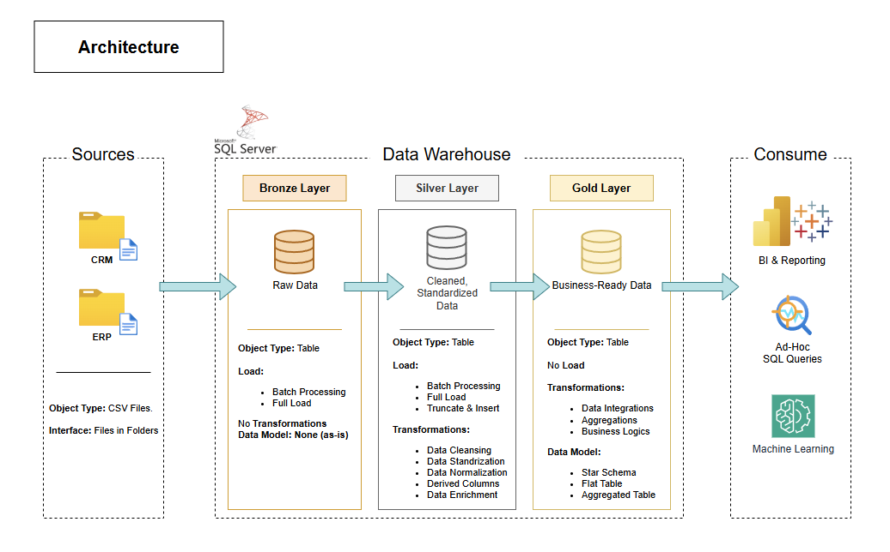
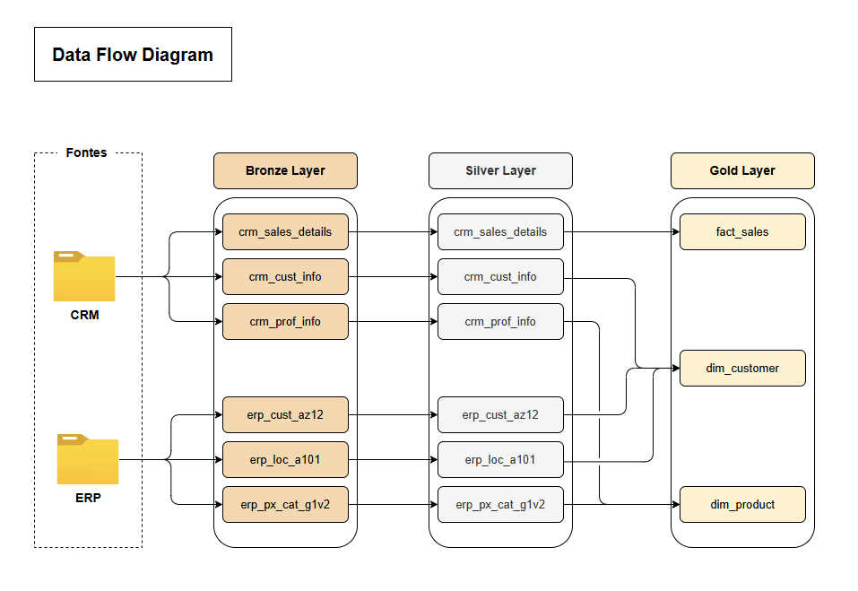

# SQL Data Warehouse Project

This project implements an end-to-end Data Warehouse using the **Medallion Architecture** (Bronze → Silver → Gold) to transform raw data from CRM and ERP systems into information ready for dimensional analysis.

---

## 🏗️ Architecture & Design

### High-Level Architecture
The project follows a modular approach to process data through three distinct layers, ensuring quality and traceability at every step.


### Data Flow & Integration
This diagram illustrates how raw tables from CRM and ERP sources are mapped and transformed across the layers.


### Integration Model
Details the relationships and keys used to join different source systems during the Silver transformation phase.


---

## 🥇 Dimensional Model (Star Schema)

The final analytical layer is structured as a **Star Schema**, optimized for BI tools and ad-hoc querying. It uses Surrogate Keys (SK) to maintain historical integrity.
.png)

### 📚 Documentation
- [Data Catalog & Diagrams](docs/DataCatalog.md): Full documentation containing all technical diagrams and the data catalog.

---

## 📂 Folder Structure

```text
sql-data-warehouse/
├── datasets/               # Raw source data files (CRM and ERP)
├── docs/                   # Technical documentation and diagrams
└── scripts/
    ├── init/               # Initialization: database and schema creation
    ├── bronze/             # DDL and Stored Procedure for raw data load (Truncate & Load)
    ├── silver/             # DDL, Stored Procedure and transformation scripts
    │   └── transformations/  # Individual modular transformation scripts
    ├── gold/               # DDL and Views for the dimensional model (Star Schema)
    └── checks/             # Audit and data quality scripts
```

## 🏗️ Medallion Architecture Layers

| Layer | Description |
|-------|-------------|
| 🥉 **Bronze** | Ingests raw data into SQL Server without transformation. Loaded via `Truncate & Load`. |
| 🥈 **Silver** | Cleaning, type standardization, deduplication, and business rule application. |
| 🥇 **Gold** | Dimensional model (Star Schema) with Fact and Dimension Views, ready for analytical consumption. |

---

## 🚀 How to Run

1.  **Initialization**: Run `scripts/init/init_datawarehouse.sql` to create the database and schemas.
2.  **Bronze Load**: Execute the Stored Procedure `procedure_load_bronze.sql` to import raw data.
3.  **Silver Transformation**: Execute `procedure_load_silver.sql` for cleaning and standardization.
4.  **Gold Analytical Layer**: Run `ddl_gold.sql` to create the dimensional Views.
5.  **Data Quality**: Use scripts in `scripts/checks/` to audit each layer as needed.

---

## 🛠️ Technologies Used

- **Database**: SQL Server (T-SQL)
- **Modeling**: Medallion Architecture + Star Schema
- **Development Tool**: SQL Server Management Studio (SSMS)

---

## 📄 License
This project is licensed under the MIT License - see the [LICENSE](LICENSE) file for details.
