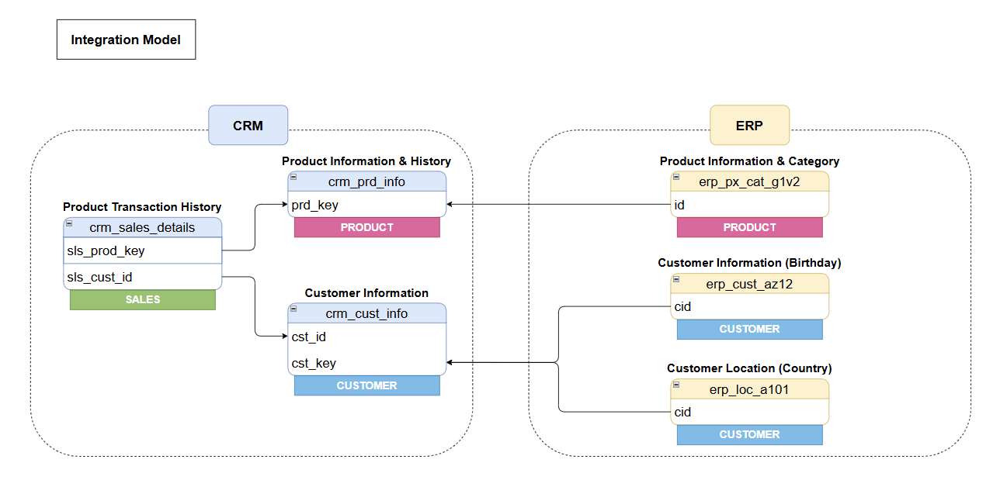

# Silver Layer

This directory contains the scripts responsible for **cleaning, standardizing, and transforming** raw Bronze data into reliable, well-structured data for the Gold layer.

## Files

| File | Description |
|------|-------------|
| `ddl_silver.sql` | DDL definition of all Silver layer tables. |
| `procedure_load_silver.sql` | Stored Procedure `silver.load_silver`: consolidates and runs all transformations in a single call. |

## Subdirectories

- **`transformations/`** — Individual modular SQL scripts with transformation logic per table. These scripts were developed as a construction step and serve as the reference base for the main `silver.load_silver` procedure.

## Applied Transformations

| Type | Description |
|------|-------------|
| **Cleaning** | Space removal with `TRIM()`, null handling and format standardization. |
| **Standardization** | Gender, marital status and category normalization via `CASE WHEN`. |
| **Date Conversion** | Numeric and text formats converted to `DATE` type. |
| **Deduplication** | `ROW_NUMBER()` to select the most recent record per key. |
| **Business Rules** | Financial integrity validation (quantity × price = sales value). |

---
---

# Camada Silver *(Português)*

Este diretório contém os scripts responsáveis pela **limpeza, padronização e transformação** dos dados brutos da camada Bronze, produzindo dados confiáveis e bem estruturados para a camada Gold.

## Arquivos

| Arquivo | Descrição |
|---------|-----------|
| `ddl_silver.sql` | Definição (DDL) de todas as tabelas da camada Silver. |
| `procedure_load_silver.sql` | Stored Procedure `silver.load_silver`: consolida e executa todas as transformações em uma única chamada. |

## Subdiretórios

- **`transformations/`** — Scripts SQL modulares e individuais com a lógica de transformação por tabela. Estes scripts foram desenvolvidos como etapa de construção e servem como base de referência para a procedure principal `silver.load_silver`.

## Transformações Aplicadas

| Tipo | Descrição |
|------|-----------|
| **Limpeza** | Remoção de espaços com `TRIM()`, tratamento de nulos e padronização de formatos. |
| **Padronização** | Normalização de gênero, estado civil e categorias via `CASE WHEN`. |
| **Conversão de Datas** | Formatos numéricos e texto convertidos para o tipo `DATE`. |
| **Deduplicação** | `ROW_NUMBER()` para selecionar o registro mais recente por chave. |
| **Regras de Negócio** | Validação de integridade financeira (quantidade × preço = valor de venda). |
